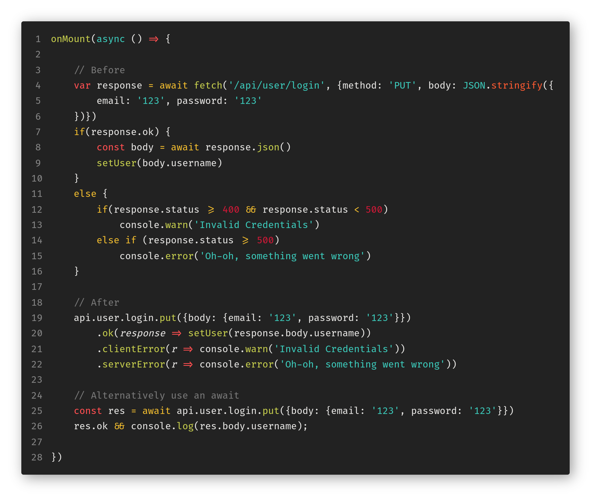

# SvelteKit Zero API
This project is a fork of [svelte-zero-api](https://github.com/ymzuiku/svelte-zero-api) by [ymzuiku](https://github.com/ymzuiku).
It has two goals
1. Two-way communication between front-end and back-end
2. Self-documenting API that can be exported that includes examples based on in-line comments

This means less coding for you, less potential errors to worry about — and an always up-to-date API Documentation.

**Todo**
- Export API documentation

### **Requirements**
- TypeScript in your SvelteKit project
[](https://youtu.be/u1sfchnI0Mo)

## Install
Add to project → `npm i sveltekit-zero-api -D`

Add to `svelte.config.js`
```js
import watchSvelteKitAPI from 'sveltekit-zero-api/watch'

if (process.env.NODE_ENV !== 'production') {
	watchSvelteKitAPI();
}
```

**How does it work?**
> It watches for changes in src/routes, and will write a __temp file that exports the types.

### **Pre-usage**
You'll be accessing `/src/api.ts` on the frontend. It's a **really** good idea to add it to Vite-alias and TS-path:

→ `svelte.config.js`
```js
import path from 'path'
...
/** @type {import('@sveltejs/kit').Config} */
const config = {
	kit: {
		/** @type {import('vite').UserConfig} */
		vite: {
			resolve: {
				alias: {
					$src: path.resolve('src')
				}
			}
		}
	}
}
```

→ `tsconfig.json`
```ts
{
	"compilerOptions": {
		"paths": {
			"$src/*": ["src/*"],
			"$src": ["src"],
		}
	}
}
```

## Usage
This example is without comments. Here's a [Commented Example](./CommentedExample.md)

Backend → `src/routes/api/core/user/login.ts`
```ts
import { Ok, BadRequest, InternalError } from 'sveltekit-zero-api/http'

const User = ({email, password}) => (email === 'email' && password === 'password') ? {
	jwtToken: 'jwtToken',
	username: 'username',
	refreshToken: 'refreshToken'
} : null

interface Put {
	body: {
		email: string,
		password: string
	}
}

export const put = async ({ body }: Put) => {
	const { email, password } = body
	const response = User({ email, password })

	if(!response)
		return BadRequest({ error: 'Invalid e-mail or password', target: 'email' })
	
	const { jwtToken, username, refreshToken } = response

	if(jwtToken) {
		return Ok({
			headers: {
				'set-cookie': [ // this is a simplified login example, please encrypt your jwt token server side
					`token=${jwtToken}; Path=/; HttpOnly;`,
				],
			},

			body: {
				refreshToken: refreshToken as string,
				username
			}
		});
	}

	return InternalError({ error: 'JWT Token could not be retrieved' })
}
```
Frontend → `src/routes/login.svelte`
```ts
<script lang="ts">
	import { TextInput } from '$components/inputs'
	import { refreshtoken, user } from '$components/stores/user'
	import api from '$src/api'
	
	let emailElement
	let passwordElement

	const email = ''
	const password = ''
	
	// Notice ­— Remember that the HTTP requests are to be done after component onMount()
	// Read more about component life-cycle: https://svelte.dev/tutorial/onmount
	const login = () => api.core.user.login.put({body: { email, password }})
		.ok(response => {
			$refreshtoken = response.body.refreshToken 
			$user.username = response.body.username
		}) 
		.clientError(response => {
			response.body.target == 'email' && emailElement.invalidate({response.body.error})
			response.body.target == 'password' && passwordElement.invalidate({response.body.error})
		})
		.serverError(response => {
			console.error('Something has happened with the servers. Oh-oh.')
		})
		

</script>

<TextInput bind:value={email} this:bind={emailElement}>
<TextInput bind:value={password} this:bind={passwordElement}>
<button on:click={login}>
```

# Other

Concerned about performance? See [performance benchmarks](./PerformanceBenchmarks.md)